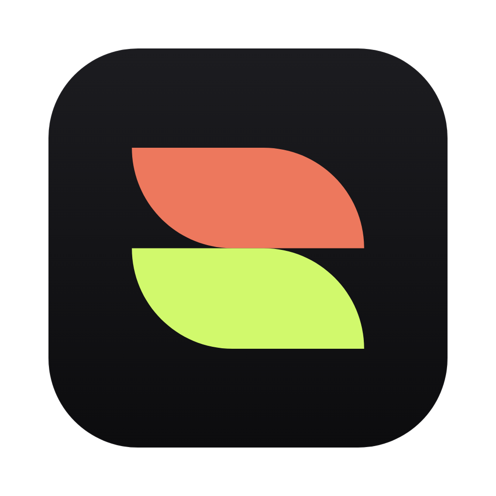

  

<h1 align="center">Stellar</h1>

  AI drafts, you steer. A Mac design app where your own Claude Code or Codex 
  designs websites, app screens, icons, posts, slides and brand books while you watch.

  
  
  

  
  &nbsp;
  

<!-- A short screen recording goes here: drag a .gif or .mp4 into this README in GitHub's editor, or add it as .github/assets/demo.gif and use:

-->

This repository holds Stellar's releases: the installers, and the files installed copies update from.

## Download

Use the buttons above, or open the [latest release](https://github.com/stellarco/releases/releases/latest) and download the `.dmg` for your Mac:

- **Apple silicon** (M1 and later): `Stellar-arm64.dmg`
- **Intel**: `Stellar-x64.dmg`

Not sure which you have? Apple menu › About This Mac. "Chip: Apple M…" means Apple silicon.

Open the `.dmg` and drag Stellar into Applications.

## What you need

- macOS 12 or later.
- **Claude Code 2.1.280 or newer**, signed in once with a Claude subscription: `npm install -g @anthropic-ai/claude-code` (or `brew install --cask claude-code@latest`), then run `claude` in Terminal and `/login`.
- Or **Codex**, signed in with ChatGPT: `npm install -g @openai/codex`, then run `codex` once in Terminal.

Stellar never logs in or talks to an AI service itself. Everything goes through your own Claude Code or Codex, on your own subscription.

## Updates

Stellar updates itself. When a new version is out, it downloads in the background and asks you to restart, or installs the next time you quit. **Stellar › Check for Updates…** checks straight away.

Versions 0.0.5 and earlier can't update themselves. If you have one of those, download the latest release once and replace the old app in Applications. Your files stay where they are, in `~/Documents/Stellar`.

## Something wrong?

In Stellar, **Help › Copy Details for a Bug Report** copies your versions, and **Help › Show Log in Finder** shows the log. Send both to whoever invited you to the beta, with what you did, what you expected and what happened.
